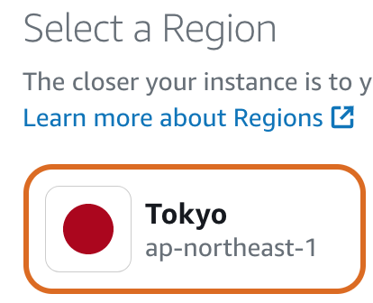
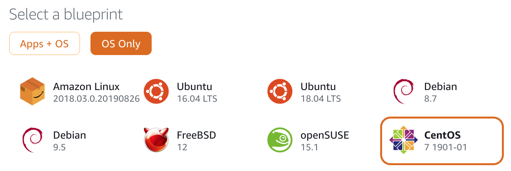
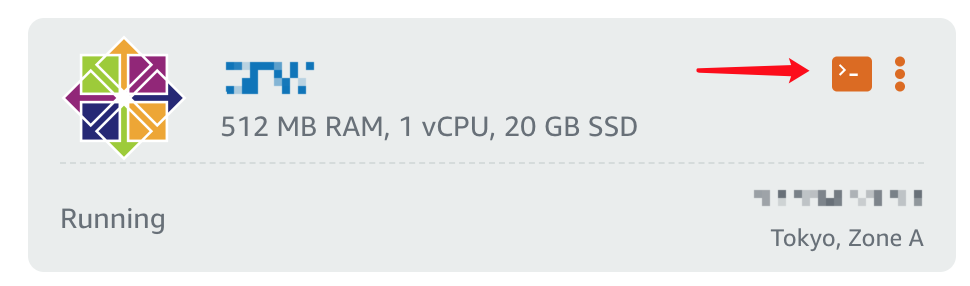
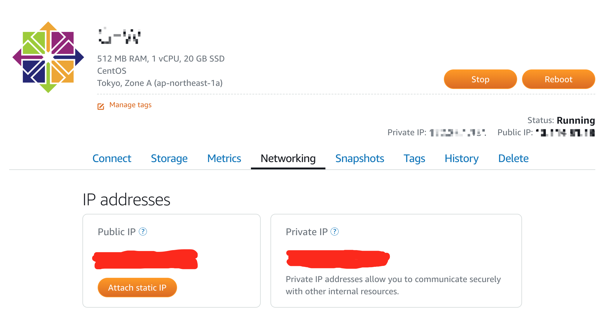
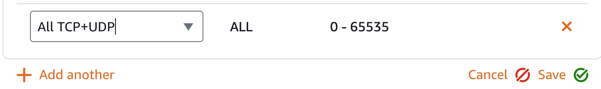
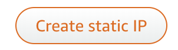
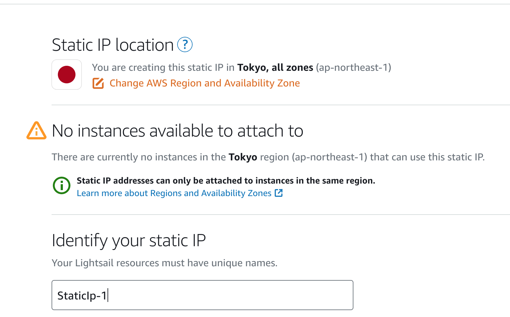
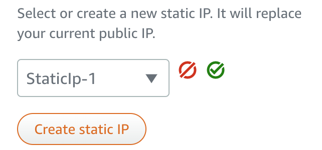

### Choose Operating Systems (Free for first month)
- Press `Create instance`

- First we will change the Instance location to Tokyo, Press `Change AWS Region and Availability Zone`

- We choose `Linux/Unix` platform and choose `CentOs` in the `Select a blueprint --- OS Only`

- Then skip to the `instance plan` selection and choose `$3.50 USD`
- U could change the VPS name in `Identify your instance`

### Connect to your VPS instance
You will see a VPS Instance with 512 MB RAM, 1 vCPU, 20 GB SSD and a default public ip. We will learn how to connect to your VPS.
- Press the `Terminal icon` beside your VPS instance. There will be a new window with `ssh` connection.

- Input `sudo passwd root` to change the password of root user. Then you will input your own password twice.
- Now we have changed the password of root. However, the aws uses openssl to ensure the security of ssh connection. We will modify the `/etc/ssh/sshd_config` to open the user-password login.
- Stay in the window of terminal, input `sudo vi /etc/ssh/sshd_config`, find the option of `PasswordAuthentication` and change the `no` to `yes`.
> vim is a text editor for the linux system, [here](https://www.runoob.com/linux/linux-vim.html) will be a simple introduction.  
> Quick start: `i`: edition mode, `esc`: exit the edition mode, `x`: delete a character, `:wq`: exit and save, `:q!`: exit without save
- Input `systemctl restart sshd.service` to activate the revision.
- We have finished the config of user-password login and you can now login to your VPS with ssh client(PUTTY etc.) or terminal(`ssh root@your_vps_ip`)

### Turn off the firewall
- Click your server name and enter the homepage of your server. Click the `Networking` tab.

- Add `all tcp and udp` rule to Filewall in the Networking tab. Click save.

### Change public ip
For aws lightsail, you can change the public ip address for your server at any time, and you could control at most 5 addresses in a time.
- Enter the `Networking` tab in the server homepage, click the `Attach static ip`
 or 
- For the latter, we will enter a new page to choose the static ip location. Click the `create` button at the botton of the page with no change to the options. Then we return to the Networking tab to attach static ip.

- Attch static ip.

